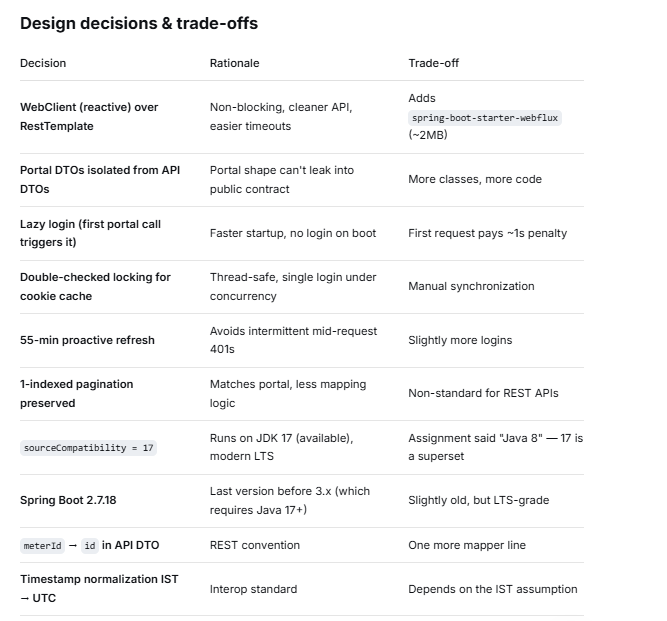
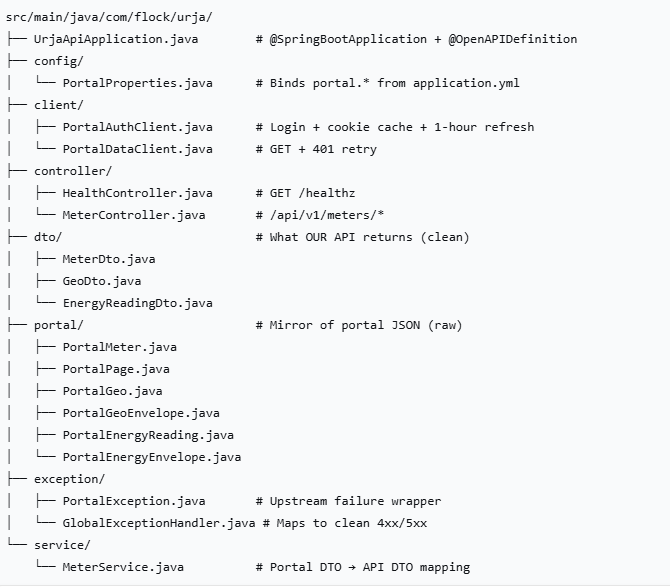

# Protocol notes
- See [PROTOCOL.md ](...)for the full reverse-engineering write-up: auth flow, endpoints, quirks, and working curl commands.

# Urja Meter Ops API

A clean, documented REST API over the [Urja Meter Ops portal](https://urja-ops.flockenergy.tech). Written in Java 17 (targeting JVM bytecode compatible with the original spec), Spring Boot 2.7.18, Gradle. Built as a submission for the Flock Energy backend exercise.

## Table of contents
## Table of contents

- [What I Develop](#what-i-develop)
- [API Endpoints](#api-endpoints)
- [Verify](#verify)
- [Sample Request for Finding Meters](#sample-request-for-finding-meters)
- [Sample Request for Finding Meter and Energy Consumption](#sample-request-for-finding-meter-and-energy-consumption)
- [Architecture](#architecture)
    - [Request lifecycle](#request-lifecycle)
    - [Component responsibilities](#component-responsibilities)
    - [401 recovery flow](#401-recovery-flow)
- [Setup](#setup)
    - [Prerequisites](#prerequisites)
    - [1. Clone the repository](#1-clone-the-repository)
    - [2. Configure credentials (optional)](#2-configure-credentials-optional)
    - [3. Run the application](#3-run-the-application)
    - [4. Verify it works](#4-verify-it-works)
    - [5. Explore the API interactively](#5-explore-the-api-interactively)
    - [6. Run the tests](#6-run-the-tests)
    - [Running from IntelliJ IDEA (optional)](#running-from-intellij-idea-optional)
    - [Running the packaged JAR (optional)](#running-the-packaged-jar-optional)
    - [Troubleshooting](#troubleshooting)
    - [Configuration reference](#configuration-reference)
- [Example](#example)
- [Assumptions](#assumptions)
- [What I intentionally skipped](#what-i-intentionally-skipped)
- [What I'd improve with more time](#what-id-improve-with-more-time)
- [Testing](#testing)
- [Project Layout](#project-layout)
- [Reflection](#reflection)
- [License](#license)
- [Protocol notes](./PROTOCOL.md)
- [OpenAPI spec](./openapi.json)

## What I Develop :

The Urja Meter Ops portal is a web UI for viewing electricity meters, their locations, and their 15-minute interval energy readings. It has no public API. This service reverse-engineers the portal's undocumented HTTP protocol and exposes it as a clean, versioned REST API with:

- A **stable resource model** (`/api/v1/meters`, `/api/v1/meters/{id}/geo`, `/api/v1/meters/{id}/energy`)
- **Auth abstraction** — the caller never sees the portal's session cookie; the service logs in, caches the session, and refreshes on 401
- **Normalized data** — ISO-8601 UTC timestamps instead of the portal's `dd/MM/yyyy HH:mm` local-time format; numeric fields as numbers instead of strings
- **OpenAPI 3 documentation** and Swagger UI


# API ENDPOINTS:


| Method | Endpoint | Description |
| :--- | :--- | :--- |
| GET | `/healthz` | API health check |
| GET | `/api/v1/meters` | Search and paginate meters (`?page=number`) |
| GET | `/api/v1/meters/{meterId}/geo` | Get geographical coordinates for a meter |
| GET | `/api/v1/meters/{meterId}/energy` | Get energy consumption readings for a meter |
| GET | `/swagger-ui.html` | Interactive API explorer |
| GET | `/v3/api-docs` | OpenAPI 3 JSON |
| GET | `/actuator/health` | Spring Boot actuator health |

Full OpenAPI spec: [openapi.json](./openapi.json)


# Verify
 **To Check API Health**

 **URL:  [http://localhost:8080/healthz](...)**

# Response
```
  Status:'ok'
```

## Interactive API docs: 
**open in a browser.**
[http://localhost:8080/swagger-ui.html](...)


# Sample Request for Finding Meters
```
curl -s 'http://localhost:8080/api/v1/meters?page=1' | head -c 400
```


# Response
```
[
  {
    "id": "J100000",
    "serialNo": "SE33962",
    "make": "HPL",
    "phaseType": "single",
    "installStatus": "Decommissioned",
    "dtCode": "DT-001"
  },
  {
    "id": "J100001",
    "serialNo": "GE84132",
    "make": "L&T",
    "phaseType": "single",
    "installStatus": "Installed",
    "dtCode": "DT-002"
  },
  {
    "id": "J100002",
    "serialNo": "AL28136",
    "make": "L&T",
    "phaseType": "single",
    "installStatus": "Installed",
    "dtCode": "DT-003"
  }
]

```


# Sample Request for Finding Meter and energy Consumption
```
curl -s 'http://localhost:8080/api/v1/meters/J100000/energy' | head -c 400
```

# Response
```
[
  {
    "timestamp": "2026-06-23T18:00:00Z",
    "kwh": 48438.74,
    "kvah": 52313.84,
    "voltR": 226
  },
  {
    "timestamp": "2026-06-23T18:30:00Z",
    "kwh": 48439.16,
    "kvah": 52314.29,
    "voltR": 229
  },
  {
    "timestamp": "2026-06-23T19:00:00Z",
    "kwh": 48439.58,
    "kvah": 52314.75,
    "voltR": 220
  },
  {
    "timestamp": "2026-06-23T19:30:00Z",
    "kwh": 48440,
    "kvah": 52315.2,
    "voltR": 230
  },
  {
    "timestamp": "2026-06-23T20:00:00Z",
    "kwh": 48440.43,
    "kvah": 52315.66,
    "voltR": 233
  }
]
```


## Note: the portal returns "23/06/2026 23:30" (IST) — this service normalizes to "2026-06-23T18:00:00Z" (ISO-8601 UTC).

## Architecture


The service is a thin proxy that authenticates against the portal, caches the
session, maps the portal's raw JSON into a clean API contract, and exposes it
over HTTP.

```
+--------------+   HTTP    +---------------+   HTTP + cookie    +----------------+
|   Client     |  ------>  |   urja-api    |  ------------->   |   urja-ops     |
|  (curl,      |           |  (this svc)   |                   |    portal      |
|   Postman)   |  <------  |    :8080      |  <-------------   |  (SvelteKit +  |
+--------------+   JSON    +---------------+    raw JSON       |   better-auth) |
                                                               +----------------+
```

### Request lifecycle

```
Client                urja-api                       urja-ops portal
  |                       |                                 |
  |  GET /api/v1/meters   |                                 |
  |---------------------->|                                 |
  |                       |  cookie cached?                 |
  |                       |  (else POST /login)             |
  |                       |                                 |
  |                       |  GET /portal/meters/search      |
  |                       |  Cookie: better-auth...         |
  |                       |-------------------------------->|
  |                       |                                 |
  |                       |  {data:[...], page, total}      |
  |                       |<--------------------------------|
  |                       |                                 |
  |                       |  map PortalMeter -> MeterDto    |
  |                       |                                 |
  |  200 OK [MeterDto..]  |                                 |
  |<----------------------|                                 |
```

### Component responsibilities

| Component | Responsibility |
|---|---|
| `HealthController` | `GET /healthz` liveness |
| `MeterController` | Public REST endpoints under `/api/v1/meters` |
| `MeterService` | Maps portal DTOs to API DTOs; normalizes timestamps IST -> UTC |
| `PortalDataClient` | Adds cookie header, retries once on 401, wraps errors |
| `PortalAuthClient` | Logs into the portal, caches session cookie (55 min), thread-safe |
| `GlobalExceptionHandler` | Maps `PortalException` -> 502, `IllegalArgumentException` -> 400 |
| `PortalProperties` | Binds `portal.*` config, overridable via env vars |
| `portal/*` | Mirror of the portal's raw JSON shapes |
| `dto/*` | Public API shapes returned to callers |

### 401 recovery flow

If the portal returns 401 (cookie expired or invalidated), `PortalDataClient`
invalidates the cached cookie, `PortalAuthClient` logs in again, and the
original request is retried **once**. If the retry also fails, the error
propagates as a `PortalException` and the API returns 502.

# Setup

### Prerequisites

| Requirement | Version | Notes |
| :--- | :--- | :--- |
| **JDK** | 17 or later | Any distribution — Temurin, Microsoft OpenJDK, Oracle. Verify with `java -version`. |
| **Git** | any recent | Only needed to clone. |
| **A terminal** | Git Bash / cmd / PowerShell | |
| **Internet** | on first run only | For downloading Gradle + dependencies. |

**What you don't need to install:**

- **Gradle** — the project ships with a Gradle wrapper (`gradlew`). It
  downloads the correct Gradle version on first run.
- **Spring Boot** — pulled in as a library dependency by Gradle.
- **Tomcat** — the servlet container is embedded in the Spring Boot JAR and
  starts inside your Java process. There is no separate Tomcat install.
- **Any other app server** — same reason.

**What you DO need:**

- **JDK 17 or later.** Java must be installed on your machine. Spring Boot
  runs *on* the JVM; it doesn't replace it.

**Internet is required on the first run.** The Gradle wrapper downloads
Gradle itself (~100MB) plus Maven Central dependencies (~50MB). After
that, everything is cached locally and works offline.

### 1. Clone the repository

```bash
git clone https://github.com/Aakashkumar22/urja-meter-ops-api_Project.git
cd urja-meter-ops-api_Project
```

### 2. Configure credentials (optional)

The application comes with **sensible defaults** baked into `application.yml`, so it runs out of the box against the demo portal. You do **not** need to configure anything to try it.

To override the defaults (recommended for anything beyond a demo):

```bash
export PORTAL_BASE_URL=https://urja-ops.flockenergy.tech
export PORTAL_USERNAME=example username
export PORTAL_PASSWORD=example password
export SERVER_PORT=8080        # optional, default 8080
```

On Windows Git Bash:
```bash
PORTAL_USERNAME=operator@urja.local PORTAL_PASSWORD=example password ./gradlew bootRun
```

The `application.yml` uses Spring's `${ENV_VAR:default}` syntax, so **environment variables always win over the yaml defaults**.

| Env var | Default                             | Purpose |
| :--- |:------------------------------------| :--- |
| `PORTAL_BASE_URL` | `https://urja-ops.flockenergy.tech` | Portal base URL |
| `PORTAL_USERNAME` | `example username`                  | Portal login email |
| `PORTAL_PASSWORD` | `example password`                  | Portal login password |
| `SERVER_PORT` | `8080`                              | HTTP port the service listens on |

### 3. Run the application

```bash
./gradlew bootRun
```

On Windows cmd:
```bash
gradlew.bat bootRun
```

The first run will download dependencies (~1 minute). Subsequent runs are near-instant.

**Expected output:**

```
  .   ____          _            __ _ _
 /\\ / ___'_ __ _ _(_)_ __  __ _ \ \ \ \
( ( )\___ | '_ | '_| | '_ \/ _` | \ \ \ \
 \\/  ___)| |_)| | | | | || (_| |  ) ) ) )
  '  |____| .__|_| |_|_| |_\__, | / / / /
 =========|_|==============|___/=/_/_/_/
 :: Spring Boot ::                (v2.7.18)

... Tomcat started on port(s): 8080 (http)
... Started UrjaApiApplication in 3.644 seconds
```

The app is now serving on `http://localhost:8080`.

### 4. Verify it works

Open a **second terminal** and run:

```bash
curl http://localhost:8080/healthz
# → {"status":"ok"}
```

Then hit a real endpoint:

```bash
curl 'http://localhost:8080/api/v1/meters?page=1' | head -c 300
```

You should see a JSON array of meters. On the **first** portal call, look at the bootRun terminal — you'll see:

```
Logging into portal at https://urja-ops.flockenergy.tech
Portal login OK. Cookie valid for 3300 more seconds.
```

This is the auth layer working: the service logs into the portal, captures the session cookie, and caches it for 55 minutes.

### 5. Explore the API interactively

Open in a browser:

- **Swagger UI:** `http://localhost:8080/swagger-ui.html` — click any endpoint to try it
- **OpenAPI JSON:** `http://localhost:8080/v3/api-docs`
- **Actuator health:** `http://localhost:8080/actuator/health` → `{"status":"UP"}`

### 6. Run the tests

```bash
./gradlew test
```

Runs `PortalAuthClientTest`, which uses OkHttp's MockWebServer to simulate the portal's login response and verifies the session cookie is captured and the `Origin` header is sent.

---

### Running from IntelliJ IDEA (optional)

1. **File → Open** → select the cloned `urja-meter-ops-api_Project` folder → **Open**.
2. IntelliJ detects the Gradle project and starts syncing. Wait for the progress bar to finish.
3. Set the JDK: **File → Project Structure → Project → SDK** → choose JDK 17.
4. Set the Gradle JVM: **File → Settings → Build, Execution, Deployment → Build Tools → Gradle → Gradle JVM** → same JDK 17.
5. Open `src/main/java/com/flock/urja/UrjaApiApplication.java` and click the green **▶** next to `main`.

### Running the packaged JAR (optional)

```bash
./gradlew build
java -jar build/libs/urja-api-0.0.1-SNAPSHOT.jar
```

Same startup output as `bootRun`. Useful for deployment scenarios.

### Troubleshooting

**`Port 8080 was already in use`**
Another process is using 8080. Either kill it:
```bash
netstat -ano | findstr :8080     # find the PID (last column)
taskkill //F //PID <pid>
```
Or change the port:
```bash
SERVER_PORT=8081 ./gradlew bootRun
```

**`JAVA_HOME is not set`**
Gradle can't find Java. Set it:
```bash
export JAVA_HOME=/path/to/jdk-17
export PATH="$JAVA_HOME/bin:$PATH"
```

**`403 Forbidden — Cross-site POST form submissions are forbidden`**
The portal's CSRF check rejected the login. This means the `Origin` header sent by the service doesn't match the portal. Verify `PORTAL_BASE_URL` is exactly `https://urja-ops.flockenergy.tech` (no trailing slash).

**`Connection refused` on first curl**
The app takes 2–3 seconds to boot after the `Started UrjaApiApplication` message. Wait a moment and retry.

**Slow first request (~1 second)**
The first call to a `/api/v1/*` endpoint triggers a portal login. Subsequent calls use the cached cookie and are near-instant.

---

### Configuration reference

Full `application.yml`:

```yaml
server:
  port: ${SERVER_PORT:8080}

portal:
  base-url: ${PORTAL_BASE_URL:https://urja-ops.flockenergy.tech}
  username: ${PORTAL_USERNAME:example username}
  password: ${PORTAL_PASSWORD:example password}
  connect-timeout-ms: 5000
  read-timeout-ms: 15000
  session-ttl-seconds: 3600
  session-refresh-safety-seconds: 300

springdoc:
  swagger-ui:
    path: /swagger-ui.html

logging:
  level:
    com.flock.urja: DEBUG
```

| Property | Meaning | Default                             |
| :--- | :--- |:------------------------------------|
| `portal.base-url` | Portal base URL | `https://urja-ops.flockenergy.tech` |
| `portal.username` | Portal login email | `example username`                  |
| `portal.password` | Portal login password | `example password`                  |
| `portal.connect-timeout-ms` | Outbound HTTP connect timeout | `5000`                              |
| `portal.read-timeout-ms` | Outbound HTTP read timeout | `15000`                             |
| `portal.session-ttl-seconds` | Expected cookie lifetime | `3600` (1 hour)                     |
| `portal.session-refresh-safety-seconds` | Refresh cookie this many seconds before expiry | `300` (5 min)                       |


## Example 
**PORTAL_USERNAME=other@urja.local SERVER_PORT=9000 ./gradlew bootRun**
## Assumptions
- Portal timestamps are in IST (Asia/Kolkata). The portal returns dd/MM/yyyy HH:mm with no timezone. Meter coordinates place them in Rajasthan, India, and the format matches regional conventions. This service converts to UTC.

- The portal is read-only for our purposes. We never POST/PUT/DELETE anything except /login.

- Session cookie TTL is 1 hour (from Max-Age=3600). We refresh 5 minutes early.

- pageSize is fixed at 20 on the portal side and cannot be overridden.

- q= search param filters serial number only — verified by testing (q=HPL → 0 results, q=SE33962 → 1 match).

- Single retry on 401. Transient network failures bubble up as 502.


# What I intentionally skipped
- Write endpoints. The portal is read-only for us.

- A GET /api/v1/meters/{id} detail endpoint. The portal has no such route — the list item is the full meter record.

- Date range filtering on /energy. The portal ignores from/to/limit params, so we'd have to buffer and slice client-side. Not worth it for a fixed 24h window.

- Transformers endpoint. The portal's /portal/dts?page=1 returns a single {data:{lat,lng}} object rather than the expected list. The list endpoint wasn't located in the time available. Documented in PROTOCOL.md.

- Rate limiting, caching, auth on our API. Out of scope for this exercise — this is a read-only proxy for demo purposes.

- Docker / docker-compose. Not needed for a local demo.

- CI/CD. Skipped given the time budget.

# What I'd improve with more time
- Contract tests against recorded portal responses. We have one MockWebServer test; more would catch portal drift.

- A short-lived in-memory cache (~1 min TTL) for meter lists — data changes every 15 min, so a small cache would cut portal load significantly.

- Mono/Flux end-to-end. Currently the WebClient blocks via .block(). True non-blocking would require returning reactive types from controllers.

- Better error granularity. Distinguish "portal down" (503) from "portal returned 4xx" (502) from "meter not found" (404).

- Structured logging + Micrometer metrics. Currently plain SLF4J.

- A Dockerfile + GitHub Actions workflow.

- Rename the repo folder to urja-api — currently UrjaApi_Project (IntelliJ default).

- Add .editorconfig to normalize line endings cross-platform (the LF/CRLF warnings from git are a hint).

- Full OpenAPI examples on each endpoint (currently only summaries).

# Testing
./gradlew test
- PortalAuthClientTest — uses OkHttp's MockWebServer to simulate the portal's login response, verifies the session cookie is captured correctly, verifies the Origin header is sent (the SvelteKit CSRF fix).

- Full end-to-end tests against the live portal are intentionally skipped — they'd be brittle and depend on the grader's network access.

# Project Layout



# Reflection
- See [REFLECTION.md](...) for the 5 reflection questions.

# License
Built as a demonstration for Flock Energy. Not licensed for production use.

Save: `Ctrl+O`, `Enter`, `Ctrl+X`.

---


