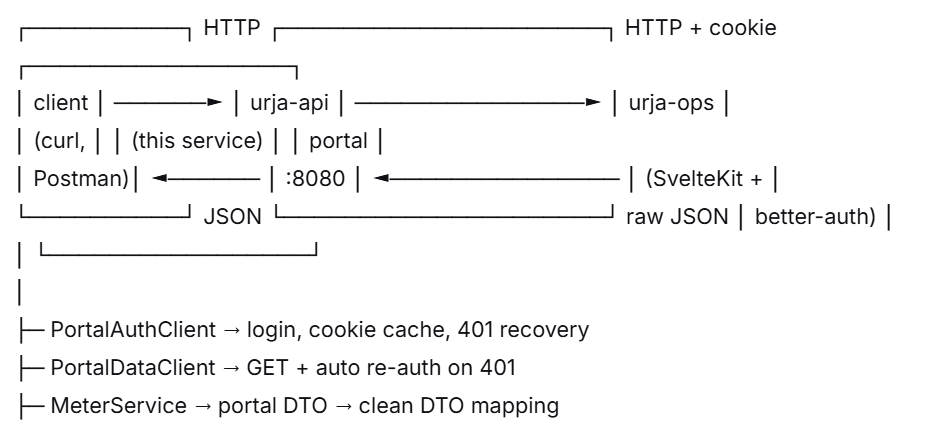
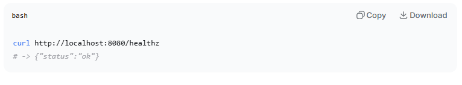
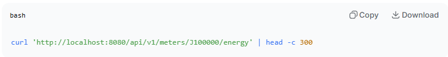
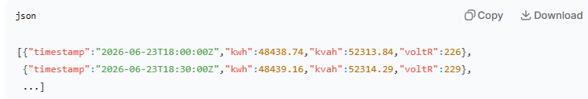
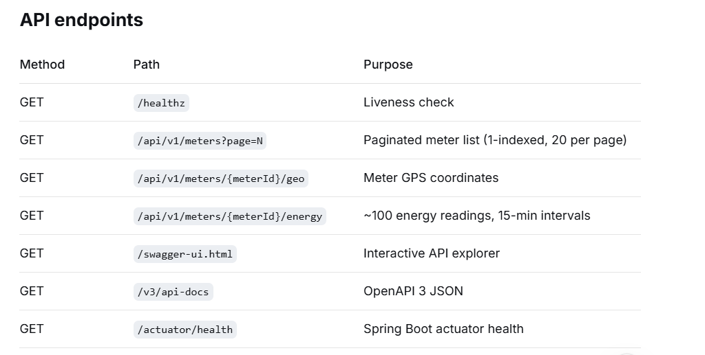
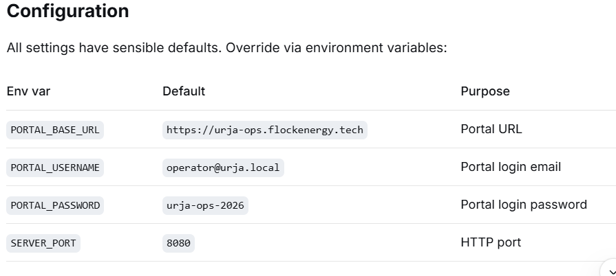

# Protocol notes
- See [PROTOCOL.md ](...)for the full reverse-engineering write-up: auth flow, endpoints, quirks, and working curl commands.

# Urja Meter Ops API

A clean, documented REST API over the [Urja Meter Ops portal](https://urja-ops.flockenergy.tech). Written in Java 17 (targeting JVM bytecode compatible with the original spec), Spring Boot 2.7.18, Gradle. Built as a submission for the Flock Energy backend exercise.

## Table of contents
- [What this is](#what-this-is)
- [Architecture](#architecture)
- [Quick start](#quick-start)
- [Sample request](#sample-request)
- [API endpoints](#api-endpoints)
- [Configuration](#configuration)
- [Assumptions](#assumptions)
- [Design decisions & trade-offs](#design-decisions--trade-offs)
- [What I intentionally skipped](#what-i-intentionally-skipped)
- [What I'd improve with more time](#what-id-improve-with-more-time)
- [Testing](#testing)
- [Project layout](#project-layout)
- [Protocol notes](./PROTOCOL.md)
- [OpenAPI spec](./openapi.json)
- [Reflection](./REFLECTION.md)

## What this is

The Urja Meter Ops portal is a web UI for viewing electricity meters, their locations, and their 15-minute interval energy readings. It has no public API. This service reverse-engineers the portal's undocumented HTTP protocol and exposes it as a clean, versioned REST API with:

- A **stable resource model** (`/api/v1/meters`, `/api/v1/meters/{id}/geo`, `/api/v1/meters/{id}/energy`)
- **Auth abstraction** — the caller never sees the portal's session cookie; the service logs in, caches the session, and refreshes on 401
- **Normalized data** — ISO-8601 UTC timestamps instead of the portal's `dd/MM/yyyy HH:mm` local-time format; numeric fields as numbers instead of strings
- **OpenAPI 3 documentation** and Swagger UI

## Architecture

**Two-layer DTO model:**
- `com.flock.urja.portal.*` — mirrors the portal's raw JSON (unchanged field names, string-encoded numbers, portal-specific envelopes)
- `com.flock.urja.dto.*` — what *your* API returns (clean names, proper types, ISO timestamps)

This anti-corruption layer means a portal-side change requires editing only a mapper, not your public contract.

# Verify
 **url:  [http://localhost:8080/healthz](...)**
# Response

## Interactive API docs: 
**open [http://localhost:8080/swagger-ui.html](...) in a browser.**

# Sample Request

# Response

## Note: the portal returns "23/06/2026 23:30" (IST) — this service normalizes to "2026-06-23T18:00:00Z" (ISO-8601 UTC).

## Full OpenAPI spec:**openapi.json**

## Example 
**PORTAL_USERNAME=other@urja.local SERVER_PORT=9000 ./gradlew bootRun**
## Assumptions
- Portal timestamps are in IST (Asia/Kolkata). The portal returns dd/MM/yyyy HH:mm with no timezone. Meter coordinates place them in Rajasthan, India, and the format matches regional conventions. This service converts to UTC.

- The portal is read-only for our purposes. We never POST/PUT/DELETE anything except /login.

- Session cookie TTL is 1 hour (from Max-Age=3600). We refresh 5 minutes early.

- pageSize is fixed at 20 on the portal side and cannot be overridden.

- q= search param filters serial number only — verified by testing (q=HPL → 0 results, q=SE33962 → 1 match).

- Single retry on 401. Transient network failures bubble up as 502.

# What I intentionally skipped
- Write endpoints. The portal is read-only for us.

- A GET /api/v1/meters/{id} detail endpoint. The portal has no such route — the list item is the full meter record.

- Date range filtering on /energy. The portal ignores from/to/limit params, so we'd have to buffer and slice client-side. Not worth it for a fixed 24h window.

- Transformers endpoint. The portal's /portal/dts?page=1 returns a single {data:{lat,lng}} object rather than the expected list. The list endpoint wasn't located in the time available. Documented in PROTOCOL.md.

- Rate limiting, caching, auth on our API. Out of scope for this exercise — this is a read-only proxy for demo purposes.

- Docker / docker-compose. Not needed for a local demo.

- CI/CD. Skipped given the time budget.

# What I'd improve with more time
- Contract tests against recorded portal responses. We have one MockWebServer test; more would catch portal drift.

- A short-lived in-memory cache (~1 min TTL) for meter lists — data changes every 15 min, so a small cache would cut portal load significantly.

- Mono/Flux end-to-end. Currently the WebClient blocks via .block(). True non-blocking would require returning reactive types from controllers.

- Better error granularity. Distinguish "portal down" (503) from "portal returned 4xx" (502) from "meter not found" (404).

- Structured logging + Micrometer metrics. Currently plain SLF4J.

- A Dockerfile + GitHub Actions workflow.

- Rename the repo folder to urja-api — currently UrjaApi_Project (IntelliJ default).

- Add .editorconfig to normalize line endings cross-platform (the LF/CRLF warnings from git are a hint).

- Full OpenAPI examples on each endpoint (currently only summaries).

# Testing
./gradlew test
- PortalAuthClientTest — uses OkHttp's MockWebServer to simulate the portal's login response, verifies the session cookie is captured correctly, verifies the Origin header is sent (the SvelteKit CSRF fix).

- Full end-to-end tests against the live portal are intentionally skipped — they'd be brittle and depend on the grader's network access.

# Project Layout

# Reflection
- See [REFLECTION.md](...) for the 5 reflection questions.

# License
Built as a demonstration for Flock Energy. Not licensed for production use.

Save: `Ctrl+O`, `Enter`, `Ctrl+X`.

---

